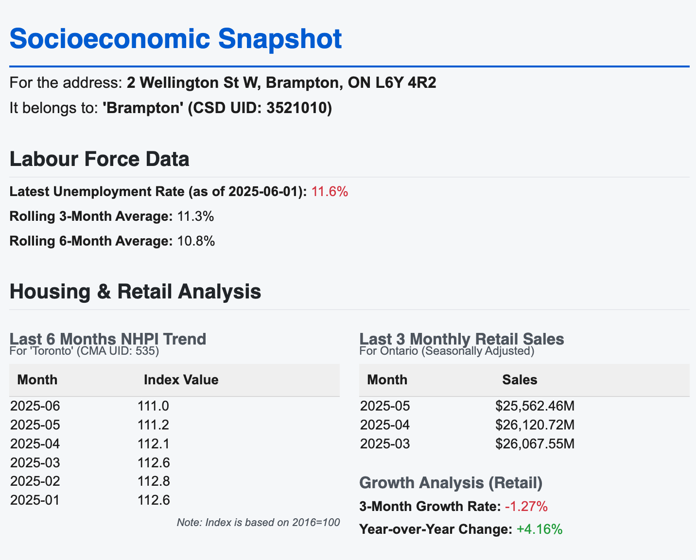

# Address To Insights with StatCan
**Turn any Canadian address into meaningful socioeconomic and market insights using StatCan data**

---

## 🔍 Overview

**Address2Insights** is a data tool that transforms any Canadian address into meaningful, location-based socioeconomic insights. It uses geocoding to identify geographic coordinates and maps them to the appropriate **StatCan census boundaries** (DA, CT, CMA, or city-level). Once located, it retrieves relevant **demographic, economic, and housing indicators** data to help businesses, analysts, or policymakers make data-driven decisions. (Currently project showcases **labour**, **housing**, and **retail** data as example.)

This project is designed to bridge the gap between raw geographic data and actionable information, making statistical data from Statistics Canada accessible, contextual, and practical.

---

## 📈 What It Does

Given any Canadian address, this tool:

- **Geocodes the address** to latitude/longitude  
- **Maps to the correct StatCan boundary unit**, based on data availability (CMA, province, etc.)
- **Fetches and processes key socioeconomic indicators**, including:

  ✅ **Labour Market Data**  
  - Local unemployment rate  
  - **Rolling 3-month and 6-month averages** to highlight trends  

  ✅ **Housing Prices (NHPI)**  
  - Last 6-month trend of new home price index  

  ✅ **Retail Sales**  
  - Latest 3-month trend and **YoY growth** comparison  
  - Adjusted to proper geographic unit depending on StatCan availability  

---

## 💼 Use Cases

- Market expansion planning based on population characteristics  
- Risk profiling for credit, insurance, or lending  
- Site selection or location intelligence for retail  
- Government or NGO service targeting  
- Enriching CRM/customer data with socioeconomic layers  

The project demonstrates a working example but can be **easily extended** to cover other StatCan data tables — **income, education, health, immigration**, etc.

---

## 🔧 Key Features

- Geocodes any Canadian address to latitude/longitude  
- Maps coordinates to the correct census geography using boundary shapefiles  
- Retrieves and aggregates selected socioeconomic indicators from open StatCan datasets  
- Modular and customizable: plug in your own datasets or adjust boundary levels  
- Built for integration: can be adapted into an API or data pipeline  

---

## 🛠️ How It Works

1. **Input**: Raw address (e.g., "123 Main Street, Calgary, AB")  
2. **Geocode**: Converts to coordinates using `geopy` or Google Maps API  
3. **Map**: Locates address within StatCan boundary using shapefiles (`GeoPandas`)  
4. **Fetch**: Downloads relevant socioeconomic data based on the boundary unit  
5. **Process**: Computes rolling averages, trends, and growth metrics  
6. **Output**: Insight-ready data for analytics or reporting  

---

## 💼 Tech Stack

- **Python**: pandas, geopandas, requests
- **StatCan Open Data**: tables, NHPI, Labour Force Survey, Retail Trade  
- **Geo tools**: Nominatim (OpenStreetMap), StatCan shapefiles  

---

## 🧪 Development

The Jupyter notebook (`Address2Insights.ipynb`) contains the full development process, including geocoding, boundary mapping, data retrieval from Statistics Canada, and calculation of rolling trends and growth rates.

The project is modular and designed for easy adaptation — whether for API development, dashboard integration, or further socioeconomic enrichment.

---

## 👤 About

Built by **Daniel Young** as a portfolio project to showcase applied data science skills in:

- Multi-source geospatial and socioeconomic data integration  
- Automated trend analysis (e.g., rolling averages, YoY change)  
- Geographic boundary mapping using GeoPandas  
- Python-based data pipelines and location intelligence tools  

---

## 📄 License

**MIT License** — feel free to use, fork, and modify this project!  
Attribution appreciated, but not required.
